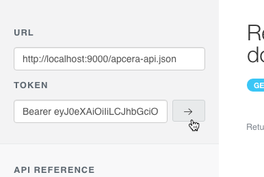
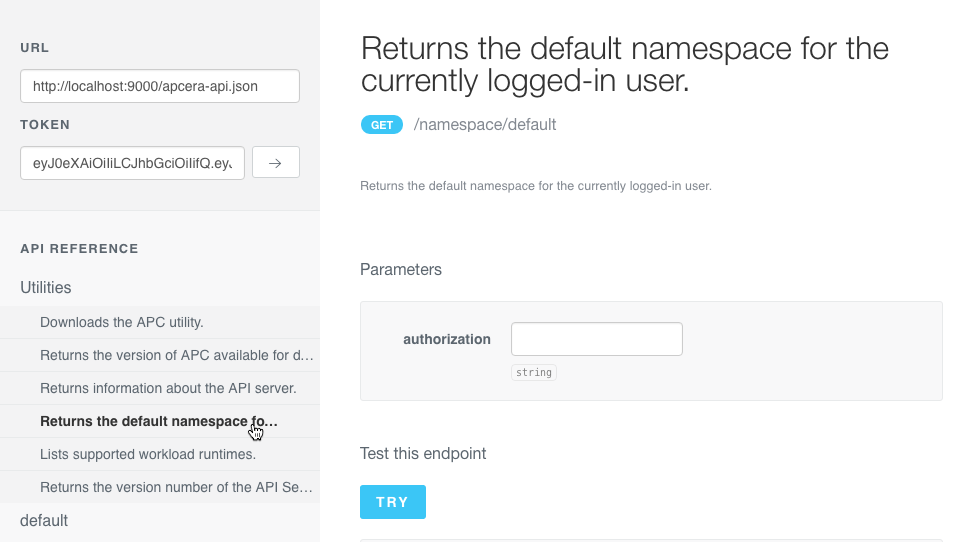

# Apcera API Explorer

The Apcera API Explorer is a web application that lets you experiment with and learn about the [Apcera REST API](docs.apcera.com/api/apcera-api-endpoints/). This is the same API used by APC and the Web Console to interact with an Apcera cluster. 

## Running the API Explorer

The API Explorer takes as input a JSON file (a Swagger specification) that describes each REST API endpoint. To use API Explorer with your cluster, you need to edit this JSON file to point to the API host on your cluster (`api.your-cluster.example.com`, for example). 

Due to cross-domain restrictions in web browsers, you must run API Explorer on a local web server at `localhost:9000`. Your Apcera cluster will not accept requests if the app is running on another domain. 

1. Open **apcera-api.json** in a text editor.
2. Locate the `host` field in the JSON file and modify it to point to your cluster API server host. For instance, if your cluster is deployed to `example.com` change `host` to the following:

        "host": "api.example.com",

4. Save your changes to `apcera-api.json`.
2. Start a local web server on `localhost:9000`. If you have Python installed you can use the built-in web server:

        python -m SimpleHTTPServer 9000
        
8. Open [http://localhost:9000](http://localhost:9000).
   
## Providing your API token

To make API calls you need to provide your API token. An easy to obtain your API token is from the `$HOME/.apc` file. This file is created by APC and contains the API tokens for each cluster you have targeted.
   
**To provide your API token**:

1. Open `~./apc` (or `$HOME/.apc`) in a text editor.
2. Locate the `tokens` field for your cluster, e.g.
        {
          "target": "https://mycluster.apcera-platform.io:443",
          "tokens": {
            "https://mycluster.apcera-platform.io:443": "Bearer eyJ0eXAiOiIiLCJhbGci..."
          },
          ...
        }
3. Copy the value of the API token for your cluster, with or without the "Bearer " preamble.  
4. In Apcera API Explorer, paste the token into the **API Token** field and click the arrow. 

    
   

You're now ready to make calls from the API Explorer. 

## Making API call

To make an API call, locate the API you want to invoke in the API Reference list and click the **Try** button. 

The results of the API call appear in a pop-up:

