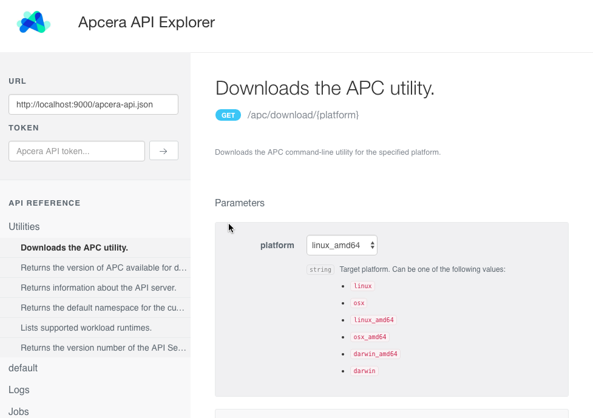
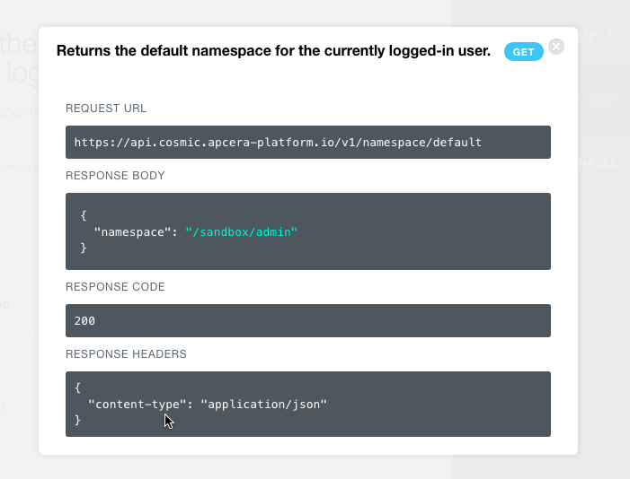
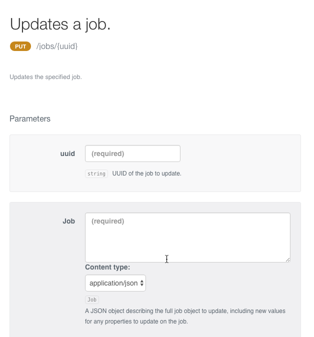
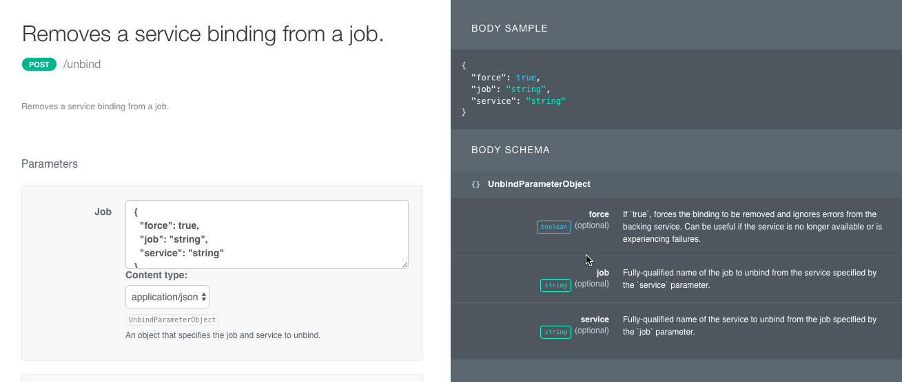

# Apcera API Explorer

The Apcera API Explorer is a web application that lets you test and learn about the [Apcera REST API](docs.apcera.com/api/apcera-api-endpoints/). 
This is the same API used by APC and the Web Console to interact with an Apcera cluster. 

The easiest way to use API Explorer is to run it [run it from a localhost](#localhost). You can also run the app [from a remote host](#remotehost); however this requires that you white-list the app's URL location in your cluster's configuration file and redeploy the cluster. 

## Setting your API host

The API Explorer takes a [Swagger specification](http://swagger.io/specification/) as input, a [JSON file](/api/apcera-api.json) that describes each endpoint in the Apcera REST API, as well as information to invoke those APIs on a specific host. To use the API Explorer you need to edit this file to point to your cluster's API host (api.your-cluster.com, for example).

**To set your API host in the Swagger specification**:

1. Open **api-explorer/apcera-api.json** in a text editor.
2. Locate the `host` field in the JSON file with the value and modify it to point to your cluster's API server host. For instance, if your cluster is deployed to `example.com` change `host` to the following:

        "host": "api.example.com",

4. Save your changes to `apcera-api.json`.

## Running the API Explorer from localhost {#localhost}

By default, you can API Explorer on a local web server at `localhost:9000`. Your Apcera cluster will not accept requests if the app is running on another domain, or on another port than `9000`.,

**To run API Explorer locally:**

1. Start a local web server on `localhost:9000`. For instance, if you have Python installed you can use its built-in web server:

        python -m SimpleHTTPServer 9000      
        
2. Open [http://localhost:9000](http://localhost:9000) to view the API Explorer.



## Running the API Explorer from a remote host  {#remotehost}

To run API Explorer on a remote host (like your Apcera cluster or other web server) you must also add the app's route to the `portal_urls` field in your cluster's configuration file (cluster.conf) and redeploy the cluster. This field determines which hosts/domains are allowed to make API calls to the cluster. 

### Deploy the app to your cluster

For example, to deploy the API Explorer to your cluster, run the following APC command. Replace `example.com` with your cluster's actual domain.

```
apc app create apiexplorer --path ~/sample-apps/api-explorer --batch --start --routes http://apiexplorer.example.com
```

This makes the app available at http://apiexplorer.example.com.

You can deploy the app to any web server.

### White-list the API Explorer app

White-listing your deployed API Explorer involves SSH'ing to the cluster, editing the cluster's configuration file (cluster.conf), and redeploying the cluster. 

**To white-list the API Explorer route on your cluster**:

1. SSH to your cluster's Orchestrator host. 
   
    * Community Edition users can use the `apcera-setup ssh orchestrator` command:
    
            apcera-setup ssh orchestrator

    * Enterprise Edition users can use their SSH tool of choice to log in as the `root` or `orchestrator` user:
    
            ssh -A root@<orchestrator_IP>

2. Once logged in, back up your cluster.conf file before making any changes:

        cp cluster.conf orig_cluster.conf
        
3. Open cluster.conf in a text editor and add the API Explore app HTTP and HTTPS routes to the `portal_urls` array inside the `chef.continuum` context:
   
        chef: {
          "continuum": {
              ...
              "portal_urls": [
                "http://auth.example.com",
                "http://console.example.com",
                "http://console-lucid.example.com",
                "https://auth.example.com",
                "https://console.example.com",
                "https://console-lucid.example.com",
                "http://localhost:9000",
                "http://apiexplorer.example.com",
                "https://apiexplorer.example.com"
              ]
              ...
           }
           ...
         }

4. Save your changes to cluster.conf.
5. Re-deploy the cluster with the change:
   
        orchestratorer-cli deploy --config cluster.conf --update-latest-release
6. Exit the SSH session.

Once the cluster has been deployed, you can start [using the API Explorer](#using).
  
## Using the API Explorer {#using}

To use the API Explorer you first need to [provide your API token](#token). You can then start [making API calls](#apicalls).

### Providing your API token {#token}

To make API calls you need to provide the API Explorer with your API token. An easy way to obtain your API token is from the `$HOME/.apc` file. This file is created by APC and contains the API tokens for each cluster you have targeted.
   
**To provide your API token**:

1. Open `~/.apc` (or `$HOME/.apc`) in a text editor.
2. Locate the `tokens` field for your cluster, e.g.

        {
          ...
          "tokens": {
            "https://mycluster.apcera-platform.io:443": "Bearer eyJ0eXAiOiIiLCJhbGci..."
          },
          ...
        }

3. Copy the value of the API token for your cluster, with or without the "Bearer " preamble.  
4. In Apcera API Explorer, paste the token into the **API Token** field and click the arrow. 

    
   
You're now ready to make [API calls](#apicalls).

### Making API Calls {#apicalls}

Once you've provided your API token, you are ready to make API calls against your cluster. To make an API call, locate the API you want to invoke in the API Reference list and click the **Try** button.


The results of the API call appear in a pop-up:



The **Parameters** section lists the parameters supported by each endpoint, with required parameters labeled as such.



To the right of each API endpoint are collapsible sections that display that API's response schema and a sample JSON response. For `PUT`/`POST` methods that take a JSON object in the request body, the request object schema and a sample JSON request object are also displayed.



## Troubleshooting

Below are common errors you may encounter using API Explorer.

* **"Header must have a preamble and a token separated by a space"** -- If a response body contains this message it means that the request did not contain the API token. Try setting your API token again (see [Providing your API token](#token)).

* **"illegal base64 data..."** -- If the response body contains this type of message it means the API token you provided contained an expected character. This can occur sometimes when copying the token from an application that uses a non-standard text encoding. Try copying the token into a plain text document first and then copying the value from that location. 

